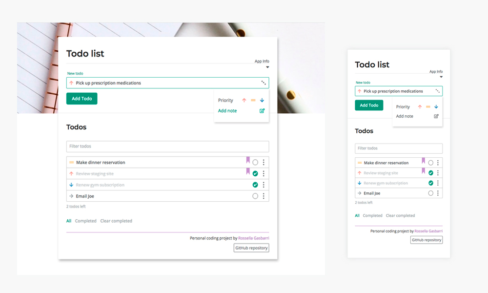
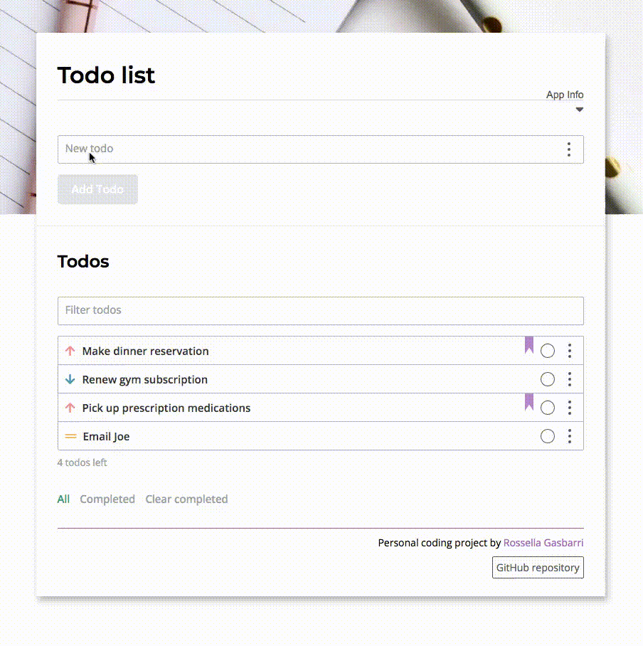

# Todo List App Vanilla Javascript

[](https://www.javascript.com)
[](https://www.npmjs.com/package/npm/v/6.14.5)
[](https://github.com/rosgas)

<br>

> A **responsive** to do list app created from scratch using **HTML**, **SCSS** and **Javascript** without the use of frameworks or libraries.

<br>



<br>
<br>

## Table of Contents

- <a href="#features-section">Features</a>
- <a href="#live-demo-section">Live Demo</a>
- <a href="#technologies-section">Technologies used</a>
- <a href="#sass-section">Sass folder structure</a>
- <a href="#js-section">JS</a>
- <a href="#setup-section">Setup/Installation</a>
- <a href="#acknowledgmens-section">Acknowledgmens</a>

<br>

<h2 id="futures-section">Features</h2>

- **Persist** and **save** todo list and todo item data within the browser using **localStorage**;

- Add a **note** and a **priority** icon (high, medium, low) to your todo;

- **Dedicated dropdown menu** for each todo, containing actions to:

  - Add/Change priority icon( high, medium, low);
  - Edit todo;
  - Add/Edit note;
  - Delete the todo;

- **Add/Edit note**:

  - a dropdown text area will show with the extra option to **delete the note**;
  - a **bookmark** is added to the related todo to better visualise wich todo contains a note;

- **Mark todos completed** with a checkbox;

- **Filter** input to filter todos based on keyword(s):

  - a text line showing the **number of matched todos** with the keyword(s);
  - user actions related to each todo are still possible when the filter is active;

- Number of **todos left**;

- **Shows all** todos button;

- **Show completed** todos button;

- **Clear completed** todos button;

- **Responsive** on all devices;

<br>



<br>

<h2 id="live-demo-section">Live demo</h2>

[Check out the demo page]()

<br>

<h2 id="technologies-section">Technologies used</h2>

- **HTLM**
- **SCSS**
- **Vanilla JavaScript**

No libraries, no query, no frameworks.

<br>

<h2 id="sass-section">Sass folder structure</h2>

```
|-- scss
      |-- main.scss                   # Main scss input file
      |-- _config.scss	              # Variables
      |-- _mixin-vendors.scss         # Common mixins used for building the UI app.
      |-- _utilities.scss             # Single-use classes and extend %placeholder selectors
      |-- _sections.scss              # Input fields(todo input, filter); Rows (todo input, filter, todos) elements.
      |-- _info-box                   # Dropdown app info box
      |-- _pop-up-demo                # Pop up app demo video
      |-- _dotted-menu                # Dotted overlay menu
      |-- _note-area                  # Dropdown textarea to add a note
      |- -_pop-up-notification        # Pop up notification to confirm/cancel to delete todo/note

```

<h2 id="js-section">JS</h2>

> Built using the **module pattern**, with the use of local storage to process and storage the data.

There are a few different controllers for different modules (each module has been created using an IIFE function and stored in a single js file):

- A **storage controller** to process and store the data;
- An **item controller** to deal with the actual data;
- Three **UI controllers** to work with the UI;
- Two **app controllers** to initialize the app. Here there are all the **event listeners** and the **init functions**.

<br>

<h2 id="setup-section">Setup/Installation</h2>

**1. Clone this repo:**

```
git clone https://github.com/rosgas/vanillajs-todo-list.git
```

**2. Make sure you have Node.js installed** because you need access to **NPM** (the easiest way to install node.js is downloading it from the official website nodejs.org)

**3. Installation**

```
npm install
```

**4. Then run**

```
npm run compileSass
```

<br>

<h2 id="license-section">License</h2>

This project is licensed under the [MIT License](LICENSE.md).

<br>

<h2 id="acknowledgmens-section">Acknowledgmens</h2>

- [GitHub Pages](https://pages.github.com/)
- [Font Awesome](https://fontawesome.com/)
- [Traversy Media](https://www.traversymedia.com/)
- [Google Fonts](https://fonts.google.com/)
